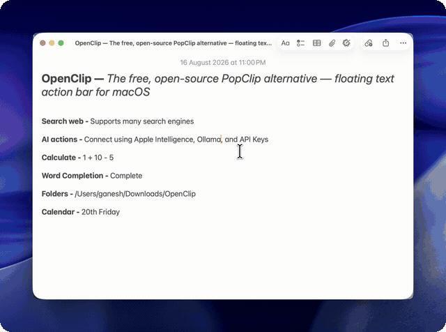

<div align="center">
  
  <h1>OpenClip</h1>
  <p>The open-source text action popup for macOS.</p>

  <p>
    <a href="https://github.com/ganeshmshetty/openclip/releases"></a>
    <a href="LICENSE"></a>
    <a href="https://github.com/ganeshmshetty/homebrew-tap"></a>
    <a href="https://discord.gg/sy4MeFxf8"></a>
  </p>

  <p>
    <a href="https://github.com/sponsors/ganeshmshetty"></a>
    <a href="https://buymeacoffee.com/ganeshmshetty"></a>
    <a href="https://ko-fi.com/ganeshmshetty"></a>
  </p>

  <br />

  
</div>

<br />

Select text in any app, and OpenClip pops up with contextual actions — transform text, run shell scripts, trigger shortcuts, evaluate math expressions, or query AI models.

## Installation

### Homebrew (Recommended)
```bash
brew install --cask openclip
```

### Direct Download
Download the latest `.dmg` from [Releases](https://github.com/ganeshmshetty/openclip/releases).

> **Note:** Requires **Accessibility** permission (`System Settings → Privacy & Security → Accessibility`) to detect selected text without relying on clipboard polling.

---

## Features

- **Contextual bar** — Appears instantly near your selection with relevant actions (case transform, search, copy/cut, math, or custom scripts).
- **Search palette (`⌥⌘C`)** — Press hotkey to fuzzy search your entire action catalog.
- **Extensions** — Write or install custom extensions in JavaScript, Shell, AppleScript, or URL schemes.
- **Native & fast** — Written in Swift 6 with strict concurrency; lightweight background footprint.
- **Optional AI actions** — Run text through local Ollama models, Apple Intelligence, or OpenAI/Anthropic keys.
- **Privacy-first** — Zero telemetry, no analytics, 100% local execution.

---

## Extensions

Extensions are simple folders in `~/.openclip/extensions/`. A basic URL lookup extension only needs an `openclip.json`:

```json
{
  "identifier": "com.example.lookup",
  "name": "Wikipedia Lookup",
  "actions": [
    {
      "title": "Lookup",
      "icon": "symbol(magnifyingglass)",
      "type": "url",
      "url": "https://en.wikipedia.org/wiki/Special:Search?search={query}"
    }
  ]
}
```

Install community extensions from **Preferences → Extension Store**, or read the [extension docs](docs/developer-guide/index.md).

---

## Building from Source

**Prerequisites:** macOS 14+, Xcode 16+, and [XcodeGen](https://github.com/yonaskolb/XcodeGen) (`brew install xcodegen`).

```bash
git clone https://github.com/ganeshmshetty/openclip.git
cd openclip

# Generate Xcode project
xcodegen generate

# Build and run
./scripts/dev_run.sh

# Run tests
./scripts/test.sh

# Package release DMG
./scripts/package_app.sh
```

---

## Community & Support

- **Docs:** [Documentation Hub](docs/index.md)
- **Discord:** [Join Community](https://discord.gg/sy4MeFxf8)
- **Issues:** [Report a bug](https://github.com/ganeshmshetty/openclip/issues)
- **Sponsor:** [GitHub Sponsors](https://github.com/sponsors/ganeshmshetty) · [Buy Me a Coffee](https://buymeacoffee.com/ganeshmshetty) · [Ko-fi](https://ko-fi.com/ganeshmshetty)

## License

[AGPL-3.0](LICENSE) © 2026 Ganesh M and OpenClip Contributors. See [NOTICE.md](NOTICE.md).
